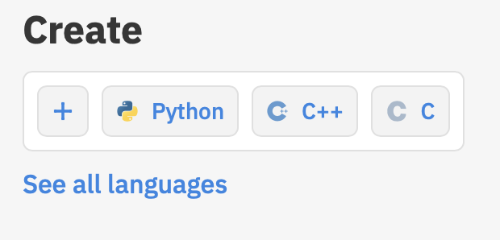
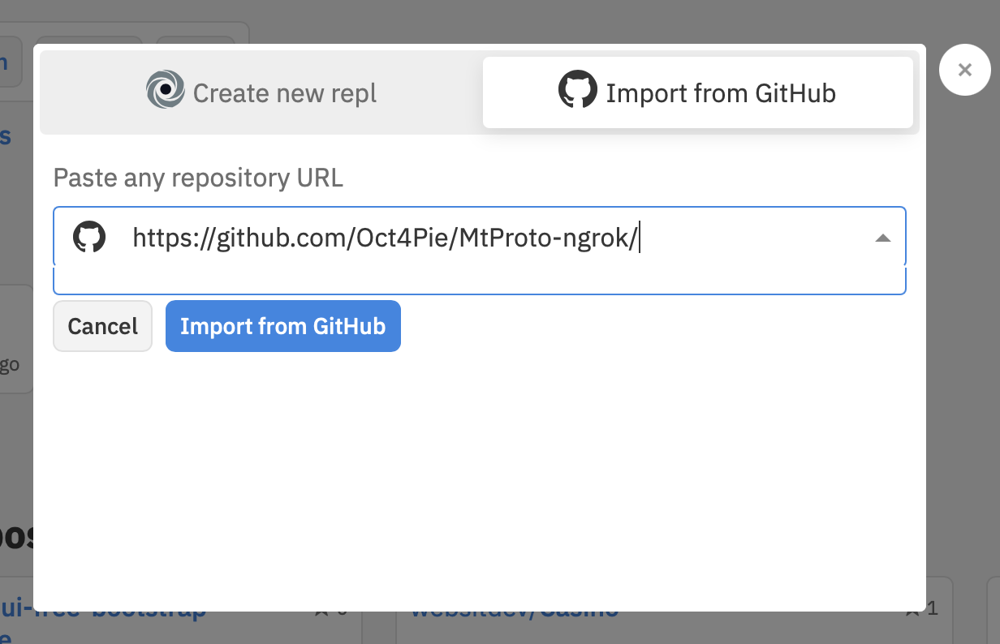

# <p align="center">MtProto-ngrok
#### <p align="center">  [راهنما فارسی](FA_README.md)
  
<p align="center"> Expose Your MtProto Proxy to the Internet

 


> You can use this project to expose your Telegram MtProto proxy and don't worry about portability and port forwarding. This project is using [mtprotoproxy](https://github.com/alexbers/mtprotoproxy), written in Python.


## Getting Started

The code has been tested on Windows 10, macOS, and most Linux operating systems with Python 3.5-3.9.
* To get a copy via git: 
```
git clone https://github.com/Oct4Pie/MtProto-ngrok.git
```

### Prerequisites

The proxy may run smoother and faster when the [cryptography](https://pypi.org/project/cryptography/) module is installed.
* It can be installed from pypi via PIP:
```
pip3 install cryptography
```
* `main.py` downloads and runs ngrok
* Ngrok requires an authentication token to route TCP traffic. You can sign up at [here](https://dashboard.ngrok.com/signup) and then obtain your token from [here](https://dashboard.ngrok.com/auth/your-authtoken).
* Set `AUTHTOKEN` in `config.py` equal to your token.

## Running
* To run the proxy server and ngrok tunnel use:
```
cd MtProto-ngrok
python3 main.py
```
* The output url can be pasted in your Telegram app
#### Example
```
$ python3 main.py
tg://proxy?server=0.tcp.ngrok.io&port=00000&secret=ee6232949ec23bd5d29764e949b9cff9e87777772e74656c656772616d2e6f7267
```


## Running on Repl.it
* You can clone the repository via repl.it
* Sign up at [https://repl.it/signup](https://repl.it/signup)
* In the homepage, under "Create," click "+"
* Enter the repository's address: [https://github.com/Oct4Pie/MtProto-ngrok.git](https://github.com/Oct4Pie/MtProto-ngrok.git)




* Choose Python as the language
* Set `run="python3 main.py"`
* Run the replit via "Run" or using shell: `python3 main.py`


## Advertising Channles

* Refer to the [@MTProxybot](https://t.me/MTProxybot) Telegram bot to obtain a tag
* Set `AD_TAG` in `config.py` equal to your tag

## Telegram Support Group
* Join us at [https://t.me/MtProtoNgrokSupport](https://t.me/MtProtoNgrokSupport)


## License
This project is licensed under the MIT License
See [LICENSE](LICENSE) file for more details

## Acknowledgments

* [Async MTProto Proxy](https://github.com/alexbers/mtprotoproxy)
* [ngrok](https://ngrok.io)


